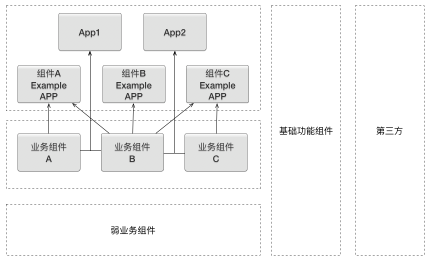
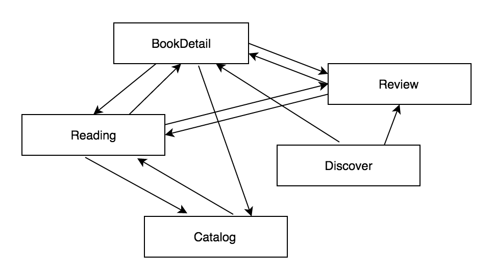
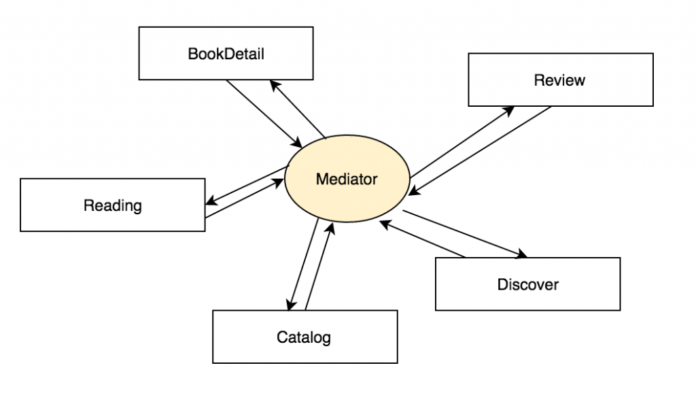
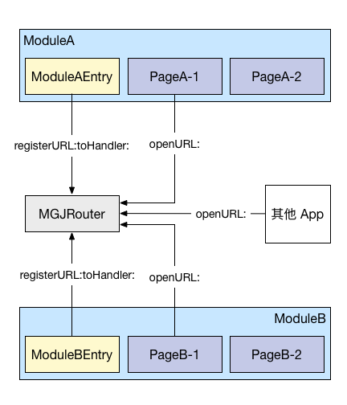
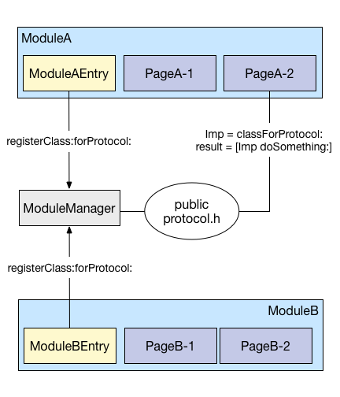
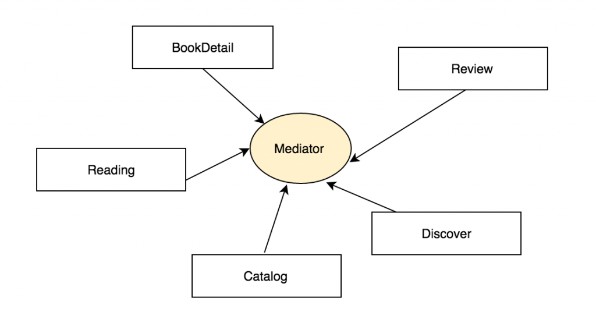

# 组件化

## 1. 什么是组件化？ <a id="1-&#x4EC0;&#x4E48;&#x662F;&#x7EC4;&#x4EF6;&#x5316;&#xFF1F;"></a>

`"组件"`一般来说用于命名比较小的功能块，如：下拉刷新组件、提示框组件。而较大粒度的业务功能，我们习惯称之为`"模块"`，如：首页模块、我的模块、新闻模块。

这次讨论的主题是组件化，这里为了方便表述，下面模块和组件代表同一个意思，都是指较大粒度的业务模块。

组件化开发，就是将一个臃肿，复杂的单一工程的项目, 根据功能或者属性进行分解，拆分成为各个独立的功能模块或者组件 ; 然后根据项目和业务的需求，按照某种方式, 任意组织成一个拥有完整业务逻辑的工程。这就是所谓的组件化开发。



## 2. 为什么要组件化 <a id="2-&#x4E3A;&#x4EC0;&#x4E48;&#x8981;&#x7EC4;&#x4EF6;&#x5316;"></a>

一个 APP 有多个模块，模块之间会通信，互相调用，如证券app，有首页、行情、资讯、我的等模块。这些模块会互相调用，例如 首页底部需要展示部分资讯、行情；行情底部需要展示个股资讯；资讯详情页需要跳转到行情，等等。

一般我们是怎样调用呢，以首页调用资讯为例，可能会这样写：

```objectivec
#import "HomeViewController.h"
#import "NewsViewController.h"

@implementation HomeViewController

+ (void)gotoNews {

 NewsViewController *detailVC = [[NewsViewController alloc] initWithStockCode:self.codeNum];
 [self.navigationController.pushViewController:detailVC animated:YES];
}

@end
```

项目初期推荐这样快速开发，但到了项目越来越庞大，这种方式会有什么问题呢？显而易见，每个模块都离不开其他模块，互相依赖粘在一起成为一坨：



这样揉成一坨对测试/编译/开发效率/后续扩展都有一些坏处，那怎么解开这一坨呢。很简单，按软件工程的思路，下意识就会加一个中间层：



合格的Mediator需要有这几个主要职责：

* 寻找指定模块，执行具体的路由操作
* 声明模块的依赖
* 声明模块的对外接口
* 对模块内各部分进行依赖注入

换成疑问句就是：

> 1. Mediator 怎么去转发组件间调用？
> 2. 一个模块只跟 Mediator 通信，怎么知道另一个模块提供了什么接口？
> 3. 按上图的画法，模块和 Mediator 间互相依赖，怎样破除这个依赖？

#### 组件化的优点 <a id="&#x7EC4;&#x4EF6;&#x5316;&#x7684;&#x4F18;&#x70B9;"></a>

**一般意义：**

* 加快编译速度（不用编译主客那一大坨代码了）；
* 各组件自由选择开发姿势（MVC / MVVM / FRP）；
* 组件工程本身可以独立开发测试，方便 QA 有针对性地测试；
* 规范组件之间的通信接，让各个组件对外都提供一个黑盒服务，减少沟通和维护成本，提高效率；

**对于公司已有项目的现实意义：**

* 业务分层、解耦，使代码变得可维护；
* 有效的拆分、组织日益庞大的工程代码，使工程目录变得可维护；
* 便于各业务功能拆分、抽离，实现真正的功能复用；
* 业务隔离，跨团队开发代码控制和版本风险控制的实现；
* 模块化对代码的封装性、合理性都有一定的要求，提升开发同学的设计能力；
* 在维护好各级组件的情况下，随意组合满足不同客户需求；（只需要将之前的多个业务组件模块在新的主App中进行组装即可快速迭代出下一个全新App）

#### 组件化的缺点 <a id="&#x7EC4;&#x4EF6;&#x5316;&#x7684;&#x7F3A;&#x70B9;"></a>

1. 增加了代码的冗余，组件化颗粒度越细，中间代码越多
2. 增加了项目的复杂度，复杂度越高越容易出问题
3. 学习成本高，对于开发人员对各种工具的掌握要求也比较高，对于新手来说入门较为困难。
4. 由于工具和流程的复杂化，导致团队之间协作的成本变高，某些情况下可能会导致开发效率下降。

## 3. 现有的组件化方案 <a id="3-&#x73B0;&#x6709;&#x7684;&#x7EC4;&#x4EF6;&#x5316;&#x65B9;&#x6848;"></a>

ios组件化的讨论从2016年Limboy的[蘑菇街 App 的组件化之路](https://limboy.me/tech/2016/03/10/mgj-components.html)、[蘑菇街 App 的组件化之路·续](https://limboy.me/tech/2016/03/14/mgj-components-continued.html)和Casa的[iOS应用架构谈组件化方案](https://casatwy.com/iOS-Modulization.html)的激烈讨论中展现了不同的组件化方案。随后，Bang在\[iOS 组件化方案探索\]\[iOS 组件化方案探索\]总结了他俩的优劣。本章还参考了之后的[iOS组件化方案调研](https://www.jianshu.com/p/34f23b694412)、[iOS 组件化 —— 路由设计思路分析](https://www.jianshu.com/p/76da56b3bd55)、[iOS 关于组件化Router设计的争辩](https://juejin.im/entry/5a24bc6d518825619a02836f)对组件化的讨论。

以下是现有的三种不同的路由方案。

1. URL路由方案
2. Protocol方案
3. Target-Action方案

### URL路由方案 <a id="url&#x8DEF;&#x7531;&#x65B9;&#x6848;"></a>

URL路由方案有很多开源库，例如[JLRoutes](https://github.com/joeldev/JLRoutes) \(`star 4847`\)、[routable-ios](https://github.com/clayallsopp/routable-ios) \(`star 1755`\)、[HHRouter](https://github.com/lightory/HHRouter) \(1550\)、[MGJRouter](https://github.com/mogujie/MGJRouter) \(`star 1769`\)。

蘑菇街页面间的调用采用了`MGJRouter`，UML图如下。各个组件初始化时向 Mediator 注册对外提供的接口，Mediator 通过保存在内存的表去知道有哪些模块哪些接口，接口的形式是 URL-&gt;block。



每个组件间都会向MGJRouter注册，组件间相互调用或者是其他的App都可以通过openURL:方法打开一个界面或者调用一个组件。

```objectivec
@implementation Mediator
typedef void (^componentBlock) (id param);
@property (nonatomic, storng) NSMutableDictionary *cache
- (void)registerURLPattern:(NSString *)urlPattern toHandler:(componentBlock)blk {
 [cache setObject:blk forKey:urlPattern];
}

- (void)openURL:(NSString *)url withParam:(id)param {
 componentBlock blk = [cache objectForKey:url];
 if (blk) blk(param);
}
@end
```

```objectivec
#import "Mediator.h"
#import "WRBookDetailViewController.h"
+ (void)initComponent {
 [[Mediator sharedInstance] registerURLPattern:@"weread://bookDetail" toHandler:^(NSDictionary *param) {
  WRBookDetailViewController *detailVC = [[WRBookDetailViewController alloc] initWithBookId:param[@"bookId"]];
  [[UIApplication sharedApplication].keyWindow.rootViewController.navigationController pushViewController:detailVC animated:YES];
 }];
}
```

```objectivec
#import "Mediator.h"
+ (void)gotoDetail:(NSString *)bookId {
 [[Mediator sharedInstance] openURL:@"weread://bookDetail" withParam:@{@"bookId": bookId}];
}
```

#### 优点 <a id="&#x4F18;&#x70B9;"></a>

* 极高的动态性
* 统一多端路由规则
* 适配URL scheme

#### 缺点 <a id="&#x7F3A;&#x70B9;"></a>

* 不适合通用模块
* 安全性差
* 维护困难
* 不能传递NSObject的参数

远程调用是本地调用的子集，这里混在一起导致组件只能提供子集功能，无法提供全集功能。所以这个方案是天生有缺陷的，对于遗漏的这部分功能，蘑菇街使用了另一种Protocol方案补全。



### Protocol方案 <a id="protocol&#x65B9;&#x6848;"></a>

蘑菇街为了区分开页面间调用和组件间调用，于是想出了一种新的方法。用Protocol的方法来进行组件间的调用。

> 每个组件之间都有一个 Entry，这个 Entry，主要做了三件事：
>
> 1. 注册这个组件关心的 URL
> 2. 注册这个组件能够被调用的方法/属性
> 3. 在 App 生命周期的不同阶段做不同的响应

在组件间的调用，蘑菇街采用了Protocol的方式。

Protocol方案的简单实现（新的中间件）：

```objectivec
@implementation ProtocolMediator
@property (nonatomic, storng) NSMutableDictionary *protocolCache
- (void)registerProtocol:(Protocol *)proto forClass:(Class)cls {
 NSMutableDictionary *protocolCache;
 [protocolCache setObject:cls forKey:NSStringFromProtocol(proto)];
}

- (Class)classForProtocol:(Protocol *)proto {
 return protocolCache[NSStringFromProtocol(proto)];
}
@end
```

然后有一个公共Protocol文件，定义了每一个组件对外提供的接口：

```objectivec
@protocol BookDetailComponentProtocol <NSObject>
- (UIViewController *)bookDetailController:(NSString *)bookId;
- (UIImage *)coverImageWithBookId:(NSString *)bookId;
@end

@protocol ReviewComponentProtocol <NSObject>
- (UIViewController *)ReviewController:(NSString *)bookId;
@end
```

再在模块里实现这些接口，并在初始化时调用 `registerProtocol` 注册。

```objectivec
#import "ProtocolMediator.h"
#import "ComponentProtocol.h"
#import "WRBookDetailViewController.h"
+ (void)initComponent
{
 [[ProtocolMediator sharedInstance] registerProtocol:@protocol(BookDetailComponentProtocol) forClass:[self class];
}

- (UIViewController *)bookDetailController:(NSString *)bookId {
 WRBookDetailViewController *detailVC = [[WRBookDetailViewController alloc] initWithBookId:param[@"bookId"]];
 return detailVC;
}

- (UIImage *)coverImageWithBookId:(NSString *)bookId {
 ...
}
```

最后调用者通过 protocol 从 `ProtocolMediator` 拿到提供这些方法的 Class，再进行调用：

```objectivec
#import "ProtocolMediator.h"
#import "ComponentProtocol.h"
+ (void)gotoDetail:(NSString *)bookId {
 Class cls = [[ProtocolMediator sharedInstance] classForProtocol:BookDetailComponentProtocol];
 id bookDetailComponent = [[cls alloc] init];
 UIViewController *vc = [bookDetailComponent bookDetailController:bookId];
 [[UIApplication sharedApplication].keyWindow.rootViewController.navigationController pushViewController:vc animated:YES];
}
```

Zuik在[iOS VIPER架构实践\(三\)：面向接口的路由设计](https://juejin.im/post/59cb629c5188253cb5016322)提到了一个之前路由没有使用的概念`Required Interface` 和 `Provided Interface`。`Required Interface`就是调用者需要用到的接口，`Provided Interface`就是实际的被调用者提供的接口。使用Adapter把`Required Interface`和修改后的`Provided Interface`进行接口适配，从而达到解耦。

他在其提出的VIPER架构中提出了Protocol路由方案[ZIKRouter](https://link.juejin.im/?target=https%3A%2F%2Fgithub.com%2FZuikyo%2FZIKRouter) \(`star 173`\)，他把Wireframe、Router、Builder整合到一起，全都放到Router里，Router由模块实现并提供给外部使用。牺牲了路由的单一性原则，换取了架构的简化。（具体细节需要先展开讲解VIPER架构，有兴趣的可以先看他的前两篇博客）

#### 优点 <a id="&#x4F18;&#x70B9;"></a>

* 安全性好，维护简单
* 适用于所有模块
* 优雅地声明依赖

#### 缺点 <a id="&#x7F3A;&#x70B9;"></a>

* 动态性有限
* 需要额外适配URL Scheme

### Target-Action方案 <a id="target-action&#x65B9;&#x6848;"></a>

Target-Action方案的开源代表是[CTMediator](https://link.juejin.im/?target=https%3A%2F%2Fcasatwy.com%2FiOS-Modulization.html)\(`star 2175`\)，主要思路是组件通过中间件通信，中间件通过 runtime 接口解耦，通过 target-action 简化写法（target对应调用的模块`class`，action对应调用模块的接口`selector`），通过 category 感官上分离组件接口代码，减小单一Mediator的文件长度，对应的架构图就变成：



#### 优点 <a id="&#x4F18;&#x70B9;"></a>

* 实现简洁，整个实现的代码量很少
* 省略了路由注册的步骤，可以减少一部分内存消耗和时间消耗，但是也略微降低了调用时的性能
* 使用场景不局限于界面模块，所有模块都可以通过中介者调用

#### 缺点 <a id="&#x7F3A;&#x70B9;"></a>

* 在调用action时使用字典传参，无法保证类型安全，维护困难
* 直接使用runtime互相调用，难以明确地区分`Required Interface`和`Provided Interface`，因此其实无法实现完全解耦。和URL Router一样，在目的模块变化时，调用模块也必须做出修改
* 过于依赖runtime特性，和Swift的类型安全设计是不兼容的，也无法跨平台多端实现

## 4. 组件化方案的选择 <a id="4-&#x7EC4;&#x4EF6;&#x5316;&#x65B9;&#x6848;&#x7684;&#x9009;&#x62E9;"></a>

#### `URLRoute+Procotol`： <a id="urlrouteprocotol&#xFF1A;"></a>

1. 需要注册组件，通过注册组件使得服务方可以被中间件发现
2. 调用方通过`URL`调用服务方页面，`URL`和服务方页面的关系通过`路由表`映射，路由表需要人工维护\(硬编码\)，使用持续集成环境简化操作
3. 调用方通过`Procotol`调用非页面类服务组件，可以传递复杂对象

#### `Target-Action`： <a id="target-action&#xFF1A;"></a>

1. 不需要注册组件，通过runtime+约定命名规范\(硬编码\)的方式查找服务方
2. 区分本地调用和远程调用，本地调用通过`Target-Action`获取服务，同时为远程调用提供服务，远程调用的规则需约定好
3. 参数传递统一用Dictionary实现，获取Dictionary内所需要的内容需要通过文档或者其他说明
4. 通过category的形式拆分中间件的代码，使其分属不同组件

这两种方式谁优谁劣不好直接做判断，综合来看`URLRoute+Procotol`更适用于页面跳转这种业务较多的场景，同时配合持续集成环境，动态性更好\(通过文本信息配置代替代码\)，缺点是调用关系复杂，中间层比较庞大，需要配合持续集成环境才能有比较好的使用体验；`Target-Action`则更适合业务较杂的情况，核心代码很少，调用关系相对简单，缺点是硬编码场景较多，不过硬编码基本都在中间件里。

### [面临的问题](https://www.jianshu.com/p/4a0e33bcdf97) <a id="&#x9762;&#x4E34;&#x7684;&#x95EE;&#x9898;"></a>

#### App生命周期及事件如何下发给业务组件 <a id="app&#x751F;&#x547D;&#x5468;&#x671F;&#x53CA;&#x4E8B;&#x4EF6;&#x5982;&#x4F55;&#x4E0B;&#x53D1;&#x7ED9;&#x4E1A;&#x52A1;&#x7EC4;&#x4EF6;"></a>

例如：applicationDidEnterBackground，didRegisterUserNotificationSettings，didReceiveRemoteNotification等等。 通过注册方式，App向注册的业务组件中的协议发送消息。

#### 业务组件之间没有依赖关系，需要解耦 <a id="&#x4E1A;&#x52A1;&#x7EC4;&#x4EF6;&#x4E4B;&#x95F4;&#x6CA1;&#x6709;&#x4F9D;&#x8D56;&#x5173;&#x7CFB;&#xFF0C;&#x9700;&#x8981;&#x89E3;&#x8026;"></a>

通过依赖协议，或依赖下沉等方式解耦。准确拆分业务组件，弱业务组件，基础功能组件。保证单一原则、DRY 原则等。

#### 解决组件化页面跳转的问题 <a id="&#x89E3;&#x51B3;&#x7EC4;&#x4EF6;&#x5316;&#x9875;&#x9762;&#x8DF3;&#x8F6C;&#x7684;&#x95EE;&#x9898;"></a>

各种router。比如[MGJRouter](https://link.jianshu.com/?t=https://github.com/mogujie/MGJRouter)。 我不建议是淡出使用URL传参。理由是可以传参的对象受限制。

我们自己有一套叫GOTO的东西。使用分类。唯一的问题，你需要知道你要跳转页面的去model化参数是什么，代表该页面的枚举是什么，目前没法注册。

#### 解决业务组件之间通信的问题 <a id="&#x89E3;&#x51B3;&#x4E1A;&#x52A1;&#x7EC4;&#x4EF6;&#x4E4B;&#x95F4;&#x901A;&#x4FE1;&#x7684;&#x95EE;&#x9898;"></a>

组件间需要相互调用，监听回调。不是说不能相互依赖么？对，可以通过依赖协议或中间件（依赖下沉）等方式解决这个问题。比如[CTMediator](https://link.jianshu.com/?t=https://github.com/casatwy/CTMediator)。CTMediator应该是属于依赖下沉的方式。

#### 解决如何划分抽象业务组件、基础功能组件（业务无关）和弱业务组件 <a id="&#x89E3;&#x51B3;&#x5982;&#x4F55;&#x5212;&#x5206;&#x62BD;&#x8C61;&#x4E1A;&#x52A1;&#x7EC4;&#x4EF6;&#x3001;&#x57FA;&#x7840;&#x529F;&#x80FD;&#x7EC4;&#x4EF6;&#xFF08;&#x4E1A;&#x52A1;&#x65E0;&#x5173;&#xFF09;&#x548C;&#x5F31;&#x4E1A;&#x52A1;&#x7EC4;&#x4EF6;"></a>

这个得要从各自的实际情况出发。但有几个原则可以借鉴：

* 重要性
* 重用性
* 单一性

#### 统一的网络服务，本地存储方案等 <a id="&#x7EDF;&#x4E00;&#x7684;&#x7F51;&#x7EDC;&#x670D;&#x52A1;&#xFF0C;&#x672C;&#x5730;&#x5B58;&#x50A8;&#x65B9;&#x6848;&#x7B49;"></a>

可以通过创建弱业务Pod库解决这个问题。

为什么要这么做？ Team之间人员调动后可以快速入手。

#### 去Model化 <a id="&#x53BB;model&#x5316;"></a>

业务组件间通讯尽量去Model化。否则就得把该Model单独做成Pod库。

去Model化后，比如使用NSDictionary如何及时传播具体的参数信息？（文档？口口相传？写在头文件？）

#### 如何披露接口信息、调用方式、参数和一些规则等等 <a id="&#x5982;&#x4F55;&#x62AB;&#x9732;&#x63A5;&#x53E3;&#x4FE1;&#x606F;&#x3001;&#x8C03;&#x7528;&#x65B9;&#x5F0F;&#x3001;&#x53C2;&#x6570;&#x548C;&#x4E00;&#x4E9B;&#x89C4;&#x5219;&#x7B49;&#x7B49;"></a>

文档？口口相传？写在头文件？使用协议？

各有利弊和适用场景。

按目前情况，我们选择写在头文件。

#### 明确组件的生命周期。 <a id="&#x660E;&#x786E;&#x7EC4;&#x4EF6;&#x7684;&#x751F;&#x547D;&#x5468;&#x671F;&#x3002;"></a>

明确组件的生命周期，就能在App中统一的创建，注册，集成，协作，销毁。

#### 提供二进制化方案 <a id="&#x63D0;&#x4F9B;&#x4E8C;&#x8FDB;&#x5236;&#x5316;&#x65B9;&#x6848;"></a>

二进制化方案能够提高编译速度，提升开发效率。集中注意力在自己维护的业务组件上。 [二进制化方案](https://link.jianshu.com/?t=http://www.yiqixiabigao.com/ios-cocoapodszu-jian-ping-hua-er-jin-zhi-hua-fang-an-ji-xiang-xi-jiao-cheng/)。

#### 组件的subspec。 <a id="&#x7EC4;&#x4EF6;&#x7684;subspec&#x3002;"></a>

[subspec](https://link.jianshu.com/?t=http://www.yiqixiabigao.com/ios-cocoapodszu-jian-ping-hua-er-jin-zhi-hua-jie-jue-fang-an-ji-xiang-xi-jiao-cheng-er-zhi-subspecpian/)教程。 使用subspec可以降低集成调试门槛。集中注意力在自己维护的业务组件上。让组件间依赖更清晰。

#### 版本规范 <a id="&#x7248;&#x672C;&#x89C4;&#x8303;"></a>

可以参考[semver](https://link.jianshu.com/?t=http://semver.org/)。

也可以参考我们的： 组件的依赖版本尽量宽泛一点，精确到minor就行。在App里精确到patch就可以了。然后大家只要按照规范发版本就可以了。参考一下这个[规范](https://link.jianshu.com/?t=http://www.yiqixiabigao.com/yin-tian-xia-cocoapodshi-yong-gui-fan/)。

#### 持续集成 <a id="&#x6301;&#x7EED;&#x96C6;&#x6210;"></a>

主要工具可以有：[gitlab runner](https://link.jianshu.com/?t=https://gitlab.com/gitlab-org/gitlab-ci-multi-runner)，[jenkins](https://link.jianshu.com/?t=https://jenkins.io/)，[fastlne](https://link.jianshu.com/?t=https://github.com/fastlane/fastlane)，[fir.im](https://link.jianshu.com/?t=http://fir.im/)。

持续集成我们是这样做的。

CI工具是[gitlab runner](https://link.jianshu.com/?t=https://gitlab.com/gitlab-org/gitlab-ci-multi-runner)。每当一定条件下，会触发build IPA并且上传到[fir.im](https://link.jianshu.com/?t=http://fir.im/)。

dev分支用的是dev证书。 master分支用的是adhoc证书。

测试人员可以通过[http://fir.im/TestXXApp](https://link.jianshu.com/?t=http://fir.im/TestXXApp)或[http://fir.im/XXApp](https://link.jianshu.com/?t=http://fir.im/XXApp)来分别下载。

.gitlab-ci.yml中的构建和上传看起来是这样的：

```bash
xcodebuild -exportArchive -archivePath 'build/p4.xcarchive' -exportPath 'build' -exportOptionsPlist exportOptionsDebug.plist | xcpretty

fir publish build/*.ipa -c $CI_BUILD_REF -T $FIR_TOKEN_DEBUG
```

在组件化开发中，一定条件应该是：

* 业务组件发版更新（会自动修改App的Podfile，然后正常push。修改的部分不只是业务组件的版本号，业务组件可能需要更高版本的其他组件或第三方组件，它会在Podfile中一并修改这些库的版本号）
* dev/master分支正常push
* 手动触发

#### 代码准入 <a id="&#x4EE3;&#x7801;&#x51C6;&#x5165;"></a>

Build/Test/Lint，code review，CI。

有了CI，就可以谈谈代码准入了。

1. Build正常构建成功
2. 单元测试通过（我们用的[Kiwi](https://link.jianshu.com/?t=https://github.com/kiwi-bdd/Kiwi)）
3. Lint通过
4. [deploymate](https://link.jianshu.com/?t=http://www.deploymateapp.com/)检查API
5. [OCLint](https://link.jianshu.com/?t=http://oclint.org/)检查代码
6. CocoaPods Lint。不仅会Build一遍，还会检查podspec相关内容设置的对不对。如果没有用--allow-warnings的参数，有waring发生Lint是会不通过的。（建议把warning当作error，不要使用--allow-warings参数）
7. Code Review。
   1. 检查发版规范。比如：我们更改了一个弱业务组件，升了一个patch版本号，但其实不只是修了bug，而且还增加了向前兼容的新功能，这个时候应该升的是minor版本号。
   2. 检查代码风格。
   3. 检查潜在的bug。
   4. 检查其他只有人能看得出的问题。

.gitlab-ci.yml中的OCLint和dploymate看起来是这样的：

```bash
Deploymate --cli -t jryMobile p4.xcworkspace -V 8.0 -x

xcodebuild -workspace p4.xcworkspace -scheme p4 -configuration Adhoc -archivePath 'build/p4' archive | tee xcodebuild.log | xcpretty

oclint-xcodebuild xcodebuild.log

oclint-json-compilation-database -e Pods -e Chart -e Chart/core/jsoncpp -e RKNotificationHub.m -e TTMessage.mm -e SSNetworkInfo.m -e Tween.mm -e 略...... && echo 'OCLint Passed' || (cat report.json && exit 1)
```

#### 命名规范 <a id="&#x547D;&#x540D;&#x89C4;&#x8303;"></a>

公司名+组件名+具体名字

#### 集成调试 <a id="&#x96C6;&#x6210;&#x8C03;&#x8BD5;"></a>

各自业务组件如何调试？应该就和在主App中一样，只需要在Example App中依赖相关的其他业务组件即可。

另一种情况是，当业务组件版本更新时需要自动修改主App的Podfile中的版本，自上而下的触发集成。

#### 代码维护 <a id="&#x4EE3;&#x7801;&#x7EF4;&#x62A4;"></a>

谁来维护基础功能组件和弱业务组件？如何保证某个Team提交代码后不会影响其他Team。（包含了：代码准入，集成调试，相互协作，版本规范）

需要一个Team专门来做这个事情。

## 5. 组件化的实践参考 <a id="5-&#x7EC4;&#x4EF6;&#x5316;&#x7684;&#x5B9E;&#x8DF5;&#x53C2;&#x8003;"></a>

#### `URLRoute`： <a id="urlroute&#xFF1A;"></a>

[手把手实践《iOS组件化》](https://www.jianshu.com/p/510ee1290ab4)

[iOS App组件化开发实践](https://www.jianshu.com/p/48fbcbb36c75)（组件化的各个方面都有涉及）

#### `Procotol`： <a id="procotol&#xFF1A;"></a>

[iOS组件化方案-总结第一篇](https://www.jianshu.com/p/2cb4cc8d216e)（简易的DEMO）

[BeeHive，一次iOS模块化解耦实践](https://www.jianshu.com/p/45e46dbdb128)（阿里开源架构，源码解析博客[在此](https://www.jianshu.com/p/24f6299ebe82)）

#### `Target-Action`： <a id="target-action&#xFF1A;"></a>

[在现有工程中实施基于CTMediator的组件化方案](https://casatwy.com/modulization_in_action.html)（官方教程【推荐】）

[iOS组件化方案-总结第二篇](https://www.jianshu.com/p/a5dfd986bfa7)（简易的DEMO）

[iOS组件化（上篇）- 拆分基础组件](https://www.jianshu.com/p/760d6cd46719)

[iOS组件化（中篇）-拆分业务组件](https://www.jianshu.com/p/e6e84688f0b8)

[iOS组件化（下篇）-加载XIB、图片资源](https://www.jianshu.com/p/ad4789d88bad)

> 编辑：黄成
>
> 日期：2019.1.7

